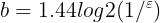

# Assignment 2 - Column-based databases

### Table of contents

- [Assignment description](#assignment-description)
- [Solution](#solution)
  * [Task 1 - Investigation](#task-1---investigation)
  * [Task 2 - Bloom Filters](#task-2---bloom-filters)
  * [Task 3 - Huffman coding](#task-3---huffman-coding)
  * [Task 4 - Map and Reduce](#task-4---map-and-reduce)

<small><i><a href='http://ecotrust-canada.github.io/markdown-toc/'>Table of contents generated with markdown-toc</a></i></small>

## Assignment description
- [Local](resources/1fd325b2-assignment_column_db.pdf)  
- [Online](https://datsoftlyngby.github.io/soft2021spring/DBD/week-10/#6-column-based-database-hbase)


## Solution

### Task 1 - Investigation


#### 1. What is point of NoSQL databases?  
*[Source](https://stackoverflow.com/questions/4154635/what-is-nosql-what-is-purpose-of-nosql-where-can-i-get-sufficient-material-on)*  
The point of the borader category of database engines that fit under the NoSQL umbrella is generally speaking that they have some advantages over traditional relational SQL databases because they give up certain features to gain other performance, scalability and developer usability features.  
  
  
**What NoSQL generally give up:**  
* Relationships between entities (and by extension the joining of tables or models together in a query).
* Limited [ACID](https://en.wikipedia.org/wiki/ACID) transactions. The level of read consistency and atomic write/commit capabilities across one or more tables/entities varies by NoSQL engine.
* No standard domain language. 
* Less structured and rigid data model. NoSQL typically forces/gives more responsibility at the application layer and to the developer to define the schema.  
  
  
**What NoSQL generally gains:**  
* Easier to shard and distribute the data across a cluster and by extension higher read/write scalability.
* NoSQL have a looser data model so you can have sparser data sets and variable data sets organized in documents or name/value column sets. Data models are not as hard wired.
* Schema migrations can be easier but puts burden on application layer to adjust to changes in data model.


#### 2. What is the CAP theorem?
*[Source](https://en.wikipedia.org/wiki/CAP_theorem)*  
The CAP theorem, states that it is impossible for a distributed data store to simultaneously provide more than two out of the following three guarantees:  
  
* Consistency: Every read receives the most recent write or an error
* Availability: Every request receives a (non-error) response, without the guarantee that it contains the most recent write
* Partition tolerance: The system continues to operate despite an arbitrary number of messages being dropped (or delayed) by the network between nodes
  
  

> *No distributed system is safe from network failures, thus network partitioning generally has to be tolerated. In the presence of a partition, one is then left with two options: consistency or availability.  
> When choosing consistency over availability, the system will return an error or a time out if particular information cannot be guaranteed to be up to date due to network partitioning. When choosing availability over consistency, the system will always process the query and try to return the most recent available version of the information, even if it cannot guarantee it is up to date due to network partitioning.  
> In the absence of network failure – that is, when the distributed system is running normally – both availability and consistency can be satisfied.  
> CAP is frequently misunderstood as if one has to choose to abandon one of the three guarantees at all times. In fact, the choice is really between consistency and availability only when a network partition or failure happens; at all other times, no trade-off has to be made.  
Database systems designed with traditional ACID guarantees in mind such as RDBMS choose consistency over availability, whereas systems designed around the BASE philosophy, common in the NoSQL movement for example, choose availability over consistency.*

#### 3. What are ideal use cases of HBase?
*[Source](https://blog.cloudera.com/apache-hbase-dos-and-donts/#usecases)*  
Hbase is an ideal choice if there is a need for random, realtime read/write access to the data.
HBase should be considered when: 
* Loading data by key
* Searching data by key or range
* Serving data by key
* Querying data by key
* Storing data by row that doesn’t conform well to a schema.

### Task 2 - Bloom Filters
Bloom filters are used in hbase as an incredible optimization. 
  
#### 1. What is a bloom filter?
*[Source](https://en.wikipedia.org/wiki/Bloom_filter)*  
A Bloom filter is a space-efficient probabilistic data structure, that is used to test whether an element is a member of a set. False positive matches are possible, but false negatives are not – in other words, a query returns either "possibly in set" or "definitely not in set".  
  


#### 2. What is an advantage of bloom filters over hash tables?
*[Source](https://www.geeksforgeeks.org/difference-between-bloom-filters-and-hashtable/)*  
*[Source](https://stackoverflow.com/a/30247022) <-- excelent comparrison between bloom filter and hash table*  

* A bloom filter doesn't store the elements themselves
* Guarantees no false negatives
* There is no need to handle collisions in bloom filters
* Uses significantly less space than a hash table

#### 3. What is a disadvantage of bloom filters?
* The false-positive rate
* It is not possible to delete elements from bloom filters

#### 4. Using your language of choice, implement a bloom filter with add and check functions. The backing bit-array can simply be a long (64 bit integer).
See [here](https://github.com/Hold-Krykke-BA/DBD/tree/main/Assignment2/task2/src) for an *ultra simple* implementation, using the [Java BitSet](https://docs.oracle.com/javase/7/docs/api/java/util/BitSet.html) (with 64 bits) for storage instead of a long to avoid bit shifting.

```java
Adding words to Bloomfilter...
Checking if the added words are caught in the filter...

hallohest is probably there -- true
invest is probably there -- true
mongodb is probably there -- true
grimes is probably there -- true
hat is probably there -- true
velour is probably there -- true
giraf is probably there -- true
discord is probably there -- true
glasfrø is probably there -- true
sildeben is probably there -- true
----------------------------------------------------------------
Checking if some other NOT added words are caught in the filter...

hejhest is probably there -- false
isbjerg is probably there -- false
mange is probably there -- false
grimer is probably there -- false
hatte is probably there -- true
velskabt is probably there -- false
elefant is probably there -- false
accord is probably there -- false
frøglas is probably there -- false
fiskeben is probably there -- false
```

#### 5. If you are to store one million ASCII strings with an average size of 10 characters in a hash set, what would be the approximate space consumption?  
Each ASCII char takes up 8 bits or 1 byte. 10 chars per string then takes up 10 bytes of space per string. 1 million strings times 10 bytes per string is 10 million bytes (10 megabyte) or 80 million bits.

#### 6. The following equation gives the required number of bits of space per inserted key, where epsilon is the false positive rate.  

<center></center>

#### 7. How many bits per element are required for a 1% false positive rate?
```Java
double result1 = (1.44 * Math.log(1.0/0.01)/Math.log(2));
System.out.println("bits per element required for 1% FPR: " + result1);

------------------------------------------------------------------
bits per element required for 1% FPR: 9.567152913275605
```

#### 8. How many bits per element are required for a 5% false positive rate?
```Java
double result5 = (1.44 * Math.log(1.0/0.05)/Math.log(2));
System.out.println("bits per element required for 5% FPR: " + result5);

------------------------------------------------------------------
bits per element required for 5% FPR: 6.223576456637802
```

#### 9. If you are to store one million ASCII strings with an average size of 10 characters in a bloom filter, what would be the approximate space consumption, given an allowed false positive rate of 5%?.
From the above question we found that each string should take up 6.22 bits of space. That gives approximately 6.220.000 bits or 0.6 megabyte. 


### Task 3 - Huffman coding
HBase internally uses a compression that is a combination of LZ77 and Huffman Coding.  
___
  
Huffman coding is a lossless data compression algorithm. The idea is to assign variable-length codes to input characters, lengths of the assigned codes are based on the frequencies of corresponding characters. The most frequent character gets the smallest code and the least frequent character gets the largest code.  
*[Source](https://www.geeksforgeeks.org/huffman-coding-greedy-algo-3/)*  
*[Source](https://brilliant.org/wiki/huffman-encoding/)*  <-- very thorough explanation.
  
#### 1. Generate Huffmann Code (and draw the Huffmann Tree) based on the following string: “beebs beepps!!!!! their eerie ears hear pears”
The code can be found [here](https://github.com/Hold-Krykke-BA/DBD/tree/main/Assignment2/task3/src) and is a modified version of this [guide](https://www.techiedelight.com/huffman-coding/).  

```Java
Original string is:
beebs beepps!!!!! their eerie ears hear pears
-------------------------------------------------------------------------------------
The codes are:
{ =110, p=1110, !=000, a=0111, r=010, b=0110, s=1111, t=00110, e=10, h=00111, i=0010}
-------------------------------------------------------------------------------------
The encoded string is:
0110101001101111110011010101110111011110000000000000001100011000111100010010110101001000101011010011101011111100011110011101011011101001110101111
-------------------------------------------------------------------------------------
The decoded string is:
beebs beepps!!!!! their eerie ears hear pears
```

#### 2. How many bits is the compressed string? How many bits is the raw ASCII string?
Each ASCII char takes up 8 bits or 1 byte. The string consists of 45 chars, so the raw AXCII string takes up 45 bytes or 360 bits. 
The encoded string consitsts of 145 bits or 18.125 bytes (when represented as a binary sequence).  

#### 3. Compress “pete is here” with the Huffmann tree from before.
```Java
Original string is:
pete is here
-------------------------------------------------------------------------------------
The codes are:
{p=1000,  =110, r=1011, s=1001, t=1010, e=0, h=1110, i=1111}
-------------------------------------------------------------------------------------
The encoded string is:
1000010100110111110011101110010110
```

#### 4. Write your own 10 word sentence. Generate the Huffmann Code (a new Huffmann Tree), and write a new compressed message (ie. in binary). Swap with one of your fellow students, and decompress each other’s message.
```diff
! Maybe insert a table with results :)
```


### Task 4 - Map and Reduce
Map and reduce is relevant because the HBase database uses MapReduce internally.
Out of the box it comes with a default setup, but it can be modified to your liking.

Example usages: http://hbase.apache.org/book.html#mapreduce.example

Results can be found in [task4\MapReduce.js](task4/MapReduce.js) and program output can be found below:

<details><summary>Program output (Click to reveal)</summary>
<p>

```js
$ node MapReduce.js 
Task 4.1  [ 1, 3, 4, 10 ]
Task 4.2  [
  '<h1>Intro</h1>',
  '<h1>Requirements</h1>',
  '<h1>Analysis</h1>',
  '<h1>Implementation</h1>',
  '<h1>Conclusion</h1>',
  '<h1>Discussion</h1>',
  '<h1>References</h1>'
]
Task 4.3  [ "I'M", 'YELLING', 'TODAY' ]
Task 4.4  [ 1, 4, 10, 5 ]
Task 4.5  [
  '',
  '',
  '',
  '',
  '',
  '',
  '',
  ''
]
Task 4.6  15
Task 4.7  6
Task 4.8  [ 1, 2, 3, 4, 5, 6 ]
Task 4.9  [ 2, 4, 5 ]
Task 4.10  {
  '46': [ { name: 'Rikke', age: 46 }, { name: 'Mathias', age: 46 } ],
  '47': [ { name: 'Michael', age: 47 } ]
}
```

</p>
</details>
